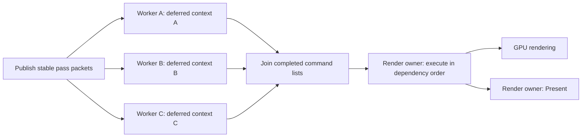

# Direct3D 11 Multithreading: Rules and a Skyrim Integration Plan

Research date: October 4, 2026. Scope: primary-source API research and inspection of the existing bridge. No renderer change, installation, or new game measurement was performed for this report.

## Finding

D3D11 supports parallel **CPU command recording** through separate deferred contexts. Finished command lists are submitted in order through the immediate context. This can move part of rendering work off Skyrim's main thread, but does not automatically parallelize engine traversal, animation, AI, or shared material preparation. The existing bridge already exercises this API mechanism; its live shadow failure and recording overhead prevent it from being an accepted optimization. [Microsoft: immediate and deferred rendering](https://learn.microsoft.com/en-us/windows/win32/direct3d11/overviews-direct3d-11-render-multi-thread-render).

The next useful step is to establish the failing passes' resource and command-list behavior. Increasing the worker count before that would add another variable. A general engine improvement would also require moving suitable preparation earlier in the renderer onto independent jobs; replaying captured draws leaves their original preparation and capture cost on the main thread. This is our architectural assessment, not a claim that Microsoft documents Skyrim internals.

## 1. Ownership and submission

A device normally permits concurrent object creation, while each device context must have at most one calling thread at a time. Give each recording worker exclusive access to its own deferred context. Keep immediate-context execution and DXGI/Present on the established render owner. Do not invoke the immediate context concurrently from workers. [Microsoft: multithreading introduction](https://learn.microsoft.com/en-us/windows/win32/direct3d11/overviews-direct3d-11-render-multi-thread-intro).

`ID3D11Multithread` protection serializes access to the immediate context and adds synchronization overhead. It does not distribute existing rendering work across cores. Separate work and separate recording contexts are still needed. [Microsoft: ID3D11Multithread](https://learn.microsoft.com/en-us/windows/win32/api/d3d11_4/nn-d3d11_4-id3d11multithread).



This shows parallel CPU recording, followed by ordered submission. D3D11 does not allow simultaneous playback of multiple lists on the same immediate context. The CPU recording join is not a GPU completion wait. [Microsoft: immediate and deferred rendering](https://learn.microsoft.com/en-us/windows/win32/direct3d11/overviews-direct3d-11-render-multi-thread-render).

## 2. Every list needs a complete starting state

Each list must explicitly establish all state its draws require. It cannot rely on the engine's current immediate-context bindings. Bind shaders, geometry, targets, depth/blend/rasterizer state, viewports, scissors, resources, samplers, and constants as applicable to the supported pipeline. Binding reduction is local to that list and starts only after the full first draw.

`FinishCommandList(FALSE, ...)` returns the deferred context to default state. The next list must start with complete bindings again. `TRUE` preserves deferred context state but is not permission to omit required commands from the next list. Use the specific API contract when interpreting flags. [Microsoft: FinishCommandList](https://learn.microsoft.com/en-us/windows/win32/api/d3d11/nf-d3d11-id3d11devicecontext-finishcommandlist).

`ExecuteCommandList(list, TRUE)` preserves the surrounding immediate-context state. With `FALSE`, that context ends in default state. A renderer that owns and maintains all bindings may benefit from `FALSE`; an injected Skyrim bridge must preserve the engine's expectations or explicitly reconcile its state tracking. Changing this flag as a generic performance tweak is inappropriate. [Microsoft: ExecuteCommandList](https://learn.microsoft.com/en-us/windows/win32/api/d3d11/nf-d3d11-id3d11devicecontext-executecommandlist).

The bridge's direct-small alternative swaps an isolated immediate-context state. State swapping does not rewind resource writes or provide a general synchronization barrier; asynchronous queries are not swapped. That mechanism cannot by itself solve a resource-ordering error. [Microsoft: SwapDeviceContextState](https://learn.microsoft.com/en-us/windows/win32/api/d3d11_1/nf-d3d11_1-id3d11devicecontext1-swapdevicecontextstate).

The intended flow can be expressed as the following pseudocode. It assumes eligible packets, established resource dependencies, checked API results, and an error path before any replacement is accepted; it is not a complete injected renderer:

```text
render owner:
    publish owned, stable packets for the eligible ordered interval
    dispatch contiguous ranges to recording workers

each worker, with its exclusive deferred context:
    establish complete initial bindings
    record that range's uploads, bindings and draws in order
    FinishCommandList(FALSE, &completed_list)
    publish completed_list to the render owner

render owner:
    join recording jobs; validate all completed lists
    ExecuteCommandList(list_0, TRUE)
    ExecuteCommandList(list_1, TRUE)  // original order, not completion order
    continue the original command stream
```

Pending replacement draws must be submitted before later original operations that mutate their resources or depend on their outputs. A CPU job join alone does not provide that ordering.

## 3. Resource identity is different from resource contents

A command list records commands and references resources; it is not a frozen copy of every referenced texture or buffer. COM references preserve object lifetime. They do not preserve an earlier version of mutable data. Microsoft's functional specification explicitly distinguishes isolated context state from global resource contents at execution time, including an example where a dynamic buffer discarded after recording supplies its newer data when the list executes. The archive uses some older API terminology; current method documentation governs the actual flags. [Microsoft functional specification, sections 6.3.3–6.3.5 and 6.3.9.1](https://microsoft.github.io/DirectX-Specs/d3d/archive/D3D11_3_FunctionalSpec.htm).

For our investigation, a valid packet therefore needs both correct bindings and a valid resource timeline. Proposed invariants:

- Source CPU data is immutable from publication until recording completes.
- Referenced objects remain alive; mutable geometry and textures retain the intended contents until their scheduled reads.
- Clears, uploads, copies, draws that write outputs, and subsequent reads retain their original dependencies.
- Context-local upload versions stay associated with the draws and lists that consume them.
- Frame or pass identifiers distinguish reused resource objects from their changing contents.

These are design requirements inferred for this bridge. Copying every shadow texture per draw is not the recommended architecture. Preserve dependencies and introduce owned versions only where the schedule actually requires them.

For example, recording a shadow pass and a lighting pass can overlap on the CPU if their input packets are stable. Submission must still produce the shadow map before lighting reads it, with the original clears, updates, and binding transitions in the proper places. A pass may have several cascades or faces; splitting by draw count alone does not describe those dependencies. None of this establishes that our current code reorders a shadow pass incorrectly.

## 4. Upload rules and hazards

| Area | Required behavior and implication |
| --- | --- |
| Deferred `Map` | Only supported dynamic-resource write modes; the first map of a resource within a list must discard. Subsequent no-overwrite use depends on resource support. Binding an unchanged buffer without mapping it is not automatically a violation. [Deferred rendering rules](https://learn.microsoft.com/en-us/windows/win32/direct3d11/overviews-direct3d-11-render-multi-thread-render). |
| Dynamic-buffer versions | Discarded writes can create context-local backing versions. Driver aliasing and later execution matter; a stable buffer pointer alone is not a content-version identifier. [Mapping on deferred contexts](https://learn.microsoft.com/en-us/windows-hardware/drivers/display/mapping-on-deferred-contexts). |
| Constant-buffer arenas | Query constant-buffer offsetting and `MapNoOverwriteOnDynamicConstantBuffer` before designing a ring/arena optimization. Supported no-overwrite does not permit overwriting bytes still used by the GPU. [D3D11 options](https://learn.microsoft.com/en-us/windows/win32/api/d3d11/ns-d3d11-d3d11_feature_data_d3d11_options). |
| Constant-buffer ranges | `*SetConstantBuffers1` offsets and lengths use 16-byte constants, with 16-constant alignment. Microsoft documents an emulated-list offset-change issue and null-rebind workaround. The bridge currently rejects unsupported source ranges; this is not an identified cause of its flicker. [VSSetConstantBuffers1](https://learn.microsoft.com/en-us/windows/win32/api/d3d11_1/nf-d3d11_1-id3d11devicecontext1-vssetconstantbuffers1). |
| Deferred updates | `UpdateSubresource` snapshots CPU source data. A documented issue concerns nonzero destination boxes on deferred contexts with software command-list emulation. Our private constants use `Map(WRITE_DISCARD)`, so the documented issue is not a demonstrated explanation. [UpdateSubresource](https://learn.microsoft.com/en-us/windows/win32/api/d3d11/nf-d3d11-id3d11devicecontext-updatesubresource). |
| Input/output conflicts | Binding an overlapping writable output can automatically null an input binding. Replay must model those transitions and subresources, including DSV/SRV overlap. [OMSetRenderTargets](https://learn.microsoft.com/en-us/windows/win32/api/d3d11/nf-d3d11-id3d11devicecontext-omsetrendertargets). |
| Queries | A list conflicting with a query already begun on its target context may not execute; `ExecuteCommandList` has no HRESULT return. Zero bridge errors alone cannot prove every intended draw executed. Keep unsupported query activity on the original path. [ExecuteCommandList](https://learn.microsoft.com/en-us/windows/win32/api/d3d11/nf-d3d11-id3d11devicecontext-executecommandlist). |

## 5. Verify the actual game device

Query Skyrim's device, rather than transferring results from a separately created test device:

| Query | What to record |
| --- | --- |
| `GetCreationFlags()` | Whether `D3D11_CREATE_DEVICE_SINGLETHREADED` is absent. Deferred-context creation fails with this flag. [CreateDeferredContext](https://learn.microsoft.com/en-us/windows/win32/api/d3d11/nf-d3d11-id3d11device-createdeferredcontext). |
| `CheckFeatureSupport(D3D11_FEATURE_THREADING)` | `DriverCommandLists` and `DriverConcurrentCreates`, including the query result. False command-list support means runtime emulation; true is not a performance guarantee. [Threading capabilities](https://learn.microsoft.com/en-us/windows/win32/api/d3d11/ns-d3d11-d3d11_feature_data_threading). |
| `GetFeatureLevel()` and relevant interfaces | Actual feature level and availability of context1/device1 features. |
| `CheckFeatureSupport(D3D11_FEATURE_D3D11_OPTIONS)` | Constant-buffer offsetting, partial update and relevant no-overwrite flags. [D3D11 options](https://learn.microsoft.com/en-us/windows/win32/api/d3d11/ns-d3d11-d3d11_feature_data_d3d11_options). |

The standalone laboratory previously reported native command-list support. The bridge does not yet publish the actual game's threading capability query. Successful worker recording is useful evidence of API availability but not a substitute for that report.

## 6. Comparison with our current code

Inspection of `src/render_stream.cpp` confirms separate worker contexts, stable packet publication followed by a join, per-recorder private dynamic constant buffers, full initial bindings, `FinishCommandList(FALSE)`, and ordered `ExecuteCommandList(TRUE)`. Large groups use contiguous draw ranges. Unsupported query/predication conditions are guarded; source mutation calls trigger queue flushing. Source constant bytes are owned; mutable geometry and texture contents are not cloned.

Two concrete review items remain:

1. The output-merger UAV eligibility check examines slots 0–7 only. Feature level 11_1 exposes 64 UAV slots, so higher slots need an appropriate rejection check on a device supporting them. Neither such use by this Skyrim scene nor a connection to the shadow error has been shown. [Microsoft feature-level capabilities](https://learn.microsoft.com/en-us/windows/win32/direct3d11/overviews-direct3d-11-devices-downlevel-intro).
2. Recording begins with `ClearState` even though successful `FinishCommandList(FALSE)` already defaults that deferred context. This is a possible later overhead reduction, subject to exception and first-use invariants. It does not justify removing the direct-small scratch-state cleanup.

Live evidence remains stronger than synthetic success: worker, uncached and full-binding modes flicker; the original path is quiet; serial replay briefly flickered and then became quiet. The expanded laboratory passes 20 tests and 896 images, including 128 shadow/lighting images. The bounded live check found no source-byte differences in 64 constants. These checks do not verify all frame transitions, geometry contents, texture versions or private worker upload consumption. See [the shadow investigation](RENDER-SHADOW-001.md).

## 7. Diagnostic implementation order

The following are proposed experiments, not completed fixes:

1. **Report actual capabilities and close eligibility gaps.** Log the queries above and audit UAV range, supported shader stages, source buffer ranges, predication and queries. Keep replacement off during capability reporting.
2. **Trace the affected pass across frames.** Use bounded records with frame/pass/draw/list/context IDs, shaders, target/depth view descriptors, SRV slots and subresources, constant-version hashes, geometry offsets, and clear/update/copy boundaries. Include writes through output draws in the resource timeline. Use shader bytecode hashes only where captured creation data exists; shader pointers alone are identities, not shader contents. Avoid raw process pointers and local machine paths in publishable reports.
3. **Separate partitioning from concurrency.** Compare one deferred context/list, four contexts/lists recorded sequentially, and the same four-way partition recorded on four workers. Preserve packet inputs and execution order as closely as possible. A failure in sequential four-context recording would weaken a pure CPU concurrency explanation; a failure only with concurrent recording would narrow the search. The existing `serial` control does not separate these variables.
4. **Isolate upload reuse.** Add a diagnostic mode that emits the first required constant version afresh in every list, while keeping packets and partitioning fixed. Compare this with persistent per-recorder reuse. Reuse is not presumed illegal; this tests a hypothesis the source-byte verification did not test.
5. **Build a temporal regression from the failing case.** Exercise multiple frames with changing shadow/camera constants, resource reuse, dynamic geometry updates, and shadow-to-lighting transitions. Retain the depth-image oracle and exact replacement counters. An exclusion that leaves a suspected shadow pass on the original path is an isolation experiment, not a general correctness fix.
6. **Only after visual acceptance, measure the new path.** Respect the requested single-path measurement: no compulsory fresh original-path FPS capture. Record frame times, main-thread critical-path time, recording and submission costs, waits, batch sizes and trace losses. Without a matched control, report an observation rather than an FPS gain.

## 8. Architecture needed for a useful speedup

Earlier V9 telemetry found 80.00% of groups smaller than the four-worker dispatch threshold of 16 draws, and 77.45% ending at an engine scope boundary. More workers cannot remove the serial capture and many small-group costs. Those boundaries cannot simply be crossed without understanding their dependencies. [V9 measurement and limits](RENDER-BRIDGE-009.md).

NVIDIA's official deferred-context presentation recommends context pooling, substantial work per list, binding reduction within a list, and measuring submission overhead. Its advice to avoid state restoration assumes renderer ownership; it is not a safe blanket rule for an injected bridge. Its historical hardware results do not predict performance in this game today. [NVIDIA: Deferred Contexts, Primer & Best Practices](https://developer.nvidia.com/sites/default/files/akamai/gamedev/docs/GDC_2013_DUDASH_DeferredContexts.pdf).

Our proposed longer-term structure is: identify a render preparation boundary, publish immutable pass inputs once, prepare independent visible-object/material packets on workers, record sufficiently large ordered chunks, and submit on the render owner. Shared mutable engine structures require proven ownership or snapshots before relocation. An upload arena may reduce tiny maps and buffer allocations once its capabilities, range bindings and lifetime rules are validated.

A useful accounting model is:

```text
new CPU critical path = serial preparation/capture
                     + longest worker recording path
                     + synchronization and ordered submission
```

This is an illustrative model, not a measured prediction; GPU limits and CPU/GPU overlap also affect the frame. The target is shorter frame time and less serial work, not maximum CPU utilization. D3D11 makes this renderer design possible, while engine integration, correctness and granularity determine whether it is beneficial.

Research outcome: the existing API direction is feasible. The shadow cause remains unknown. The next implementation should provide capability and pass/resource diagnostics before another optimization experiment. The installed DLL and public repository were not changed by this research.
